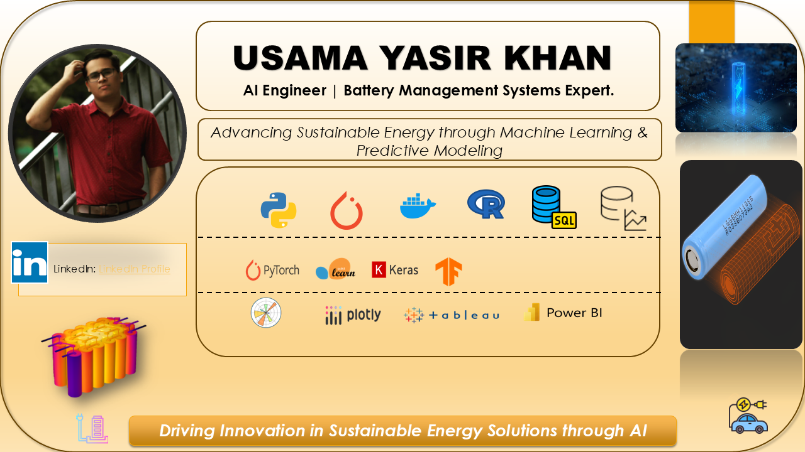

<!-- Profile Header Image -->
 

# 👋 Hi there, I'm Usama Yasir Khan!
I'm an **AI Engineer at XING Mobility** with a passion for advancing technology in battery management systems, machine learning, and AI-driven solutions for real-world challenges. I specialize in temperature prediction, state estimation, and digital twin development for energy storage systems and electric vehicles.

---

### 💼 About Me
- 🔭 **Current Role**: AI Engineer at XING Mobility, working on AI Battery Management Systems
- 🚗 **Industry**: Electric vehicles, Battery Management Systems (BMS), Renewable Energy
- 🌱 **Interests**: Battery state estimation, predictive maintenance, digital twins, sustainable tech
- 💬 **Ask me about**: Machine Learning, Battery Systems, Data Analysis, Predictive Modeling
- 🛠️ **Agile Development**: Experienced in Agile methodologies, using **Tuleap** for Sprint planning, tracking tasks, and facilitating daily stand-up meetings for smooth and efficient development.

---

### 🚀 Agile/Sprint Planning Expertise

I thrive on Agile methodologies to ensure smooth, efficient, and collaborative workflows. Leveraging tools like **Tuleap**, I manage Sprints with precision and flexibility. Here's how I bring Agile into action:

---

#### 🛠️ **Key Practices**:
- 📝 **Backlog Refinement**: Prioritize tasks to align with upcoming Sprint goals.
- 🗓️ **Sprint Planning**: Define **SMART goals** and allocate tasks effectively across the team.
- ⏱️ **Daily Stand-ups**: Foster transparency with brief updates and tackle blockers head-on.
- 🔄 **Retrospectives**: Reflect, learn, and enhance workflows for continuous improvement.

---

#### 📊 **Sprint Workflow Overview**
Below is a snapshot of a typical Sprint workflow, showcasing how tasks progress from Backlog to Completion:

<table>
  <tr>
    <td align="center">
      
       **Dynamic Development**
    </td>
    <td align="center">
      
       **Agile Sprint Workflow**
    </td>
    <td align="center">
      
       **Team Collaboration**
    </td>
  </tr>
</table>

---

#### 🌟 **Why Agile Matters in Data Science?**
Agile methodologies allow me to:
1. Deliver iterative and **incremental value** with rapid prototyping and testing.
2. Adapt quickly to shifting project requirements or data insights.
3. Maintain **collaboration and transparency** across technical and non-technical stakeholders.

---

💡 _**Quote:**_  
_"Data Science thrives in Agile—an iterative approach keeps innovation and insights flowing."_  

---

🌟 Let's build smarter workflows, one Sprint at a time!

---

  
🔽 Highlights / Proficiencies / Interests / Beliefs

  
  ### Highlights
  - Extensive experience in AI and machine learning for battery management systems.
  - Proven expertise in developing predictive models for temperature and state estimation.

  ### Proficiencies
  - **Programming Languages**: Python, MATLAB
  - **Frameworks**: TensorFlow, PyTorch, Scikit-Learn
  - **Deployment**: AWS Cloud, NXP N97 MCU, i.MX RT MCU

  ### Interests
  - Battery state estimation, digital twins, renewable energy, and sustainable tech.

  ### Beliefs
  - Passionate about advancing technology for a sustainable future.
  - Believes in leveraging AI to create practical, real-world solutions.

---

### 🚀 Skills & Technologies

#### Programming Languages

#### Machine Learning & AI

#### Deployment & Cloud

#### Data Processing

#### Data Visualization

#### Optimization Techniques

#### Agile Tools

---

### 🌟 Featured Projects

#### 1. **Advanced SOC Estimation using Transfer Learning**
   - Implemented a State of Charge (SOC) estimator using transfer learning, pre-training on LG 18650HG2 Li-ion battery data and fine-tuning it for a specific electric vehicle application or a new battery chemistry.
   - **Technologies**: Python, TensorFlow
   - **[GitHub Repository](https://github.com/yasirusama61/Advanced-SOC-Estimation-using-Transfer-Learning)**

#### 2. **Battery SOC and Temperature Estimation**
   - Developed models to estimate battery SOC and temperature in immersion-cooled battery packs, incorporating time-series analysis for accurate predictions.
   - **Technologies**: Python, TensorFlow
   - **[GitHub Repository](https://github.com/yasirusama61/Battery_SOC_Temp_Estimation)**

#### 3. **Battery Temperature Prediction**
   - Developed a model to predict battery temperature using unique features from the LG 18650HG2 dataset, leveraging transfer learning to enhance predictive accuracy.
   - **Technologies**: Python, TensorFlow, Scikit-Learn
   - **[GitHub Repository](https://github.com/yasirusama61/Battery-Temperature-Prediction)**

#### 4. **Battery Aging Classification**
   - Created a classification model to assess and predict battery aging based on various operational parameters.
   - **Technologies**: Python, Scikit-Learn
   - **[GitHub Repository](https://github.com/yasirusama61/battery-aging-classification)**

#### 5. **Quality Prediction App**
   - Developed an application to predict and monitor quality metrics in manufacturing, using machine learning for proactive quality assurance.
   - **Technologies**: Python, Dash, XGBoost
   - **[GitHub Repository](https://github.com/yasirusama61/Quality_APP)**

#### 6. **Early Risk Detection System**
   - Created a predictive maintenance system to detect risks early in the battery manufacturing process, allowing for timely interventions.
   - **Technologies**: Python, Scikit-Learn
   - **[GitHub Repository](https://github.com/yasirusama61/early-risk-detection)**

---

Feel free to explore my other repositories for more insights into my work and contributions.

### 📈 GitHub Stats and Most Used Languages

<table>
  <tr>
    <td>
      
    </td>
    <td>
      
    </td>
  </tr>
</table>

### GitHub Activity Graph

### 🔥 GitHub Streak Stats

### 📫 Connect with Me

- 💼 [LinkedIn](https://www.linkedin.com/in/usama-yasir-khan-856803173/)
- 📧 [Email](mailto:yasirusama61@gmail.com)

---

### 🔍 Current Focus
- **Dashboard Creation**: Developing a visualization tool for real-time temperature monitoring in batteries.
- **Explainable AI (XAI)**: Adding SHAP-based interpretability to machine learning models for enhanced transparency.
- **Edge Deployment**: Exploring deployment options for BMS applications on resource-constrained devices.
- **Agile Collaboration**: Using tools like Tuleap for Sprint planning and task tracking to ensure efficient project progression.

---

### 🌱 Future Goals
I'm excited to continue expanding my expertise in:
- **Advanced state estimation techniques** for electric vehicle batteries
- **Integration of AI with IoT** for smarter energy management solutions
- **Building scalable predictive models** for renewable energy applications

---

### 🏆 References and Acknowledgments

1. **Dataset**: *LG 18650HG2 Li-ion Battery Data and Example Deep Neural Network xEV SOC Estimator Script*, by Philip Kollmeyer, Carlos Vidal, Mina Naguib, and Michael Skells at McMaster University. DOI: [10.17632/cp3473x7xv.3](https://doi.org/10.17632/cp3473x7xv.3)

2. **PyBAMM**: The open-source Python Battery Mathematical Modeling (PyBAMM) library, developed by the PyBAMM community, provides a flexible framework for battery simulations. For more information, visit the official PyBAMM repository: [PyBAMM GitHub](https://github.com/pybamm-team/PyBaMM) or the project website: [PyBAMM.org](https://www.pybamm.org/).

3. **Battery Dataset**: Additional datasets from the *Stanford DAWN Benchmarking Suite* and *NASA Prognostics Data Repository* have also informed aspects of my battery research. These repositories provide public datasets for battery degradation and health estimation. Links to the repositories:
   - [Stanford DAWN Benchmarking Suite](https://dawn.cs.stanford.edu/benchmark/)
   - [NASA Prognostics Data Repository - Battery Data](https://www.nasa.gov/content/prognostics-data-repository)

4. **Methodologies and Algorithms**: Several optimization and machine learning techniques used in my work were inspired by widely recognized research papers and methods in the field of AI-driven battery management. Special thanks to the machine learning and battery modeling research communities for their contributions.

5. **Acknowledgments**: Special thanks to the contributors and researchers who have inspired my work in battery technology, including the creators of PyBAMM and the authors of publicly available datasets. Their work has greatly enriched my ability to develop predictive models and digital twin systems for battery management.

---

Thank you for visiting my profile! Feel free to reach out if you'd like to discuss AI, battery management, Agile practices, or potential collaborations. Let’s build the future of sustainable energy together!
